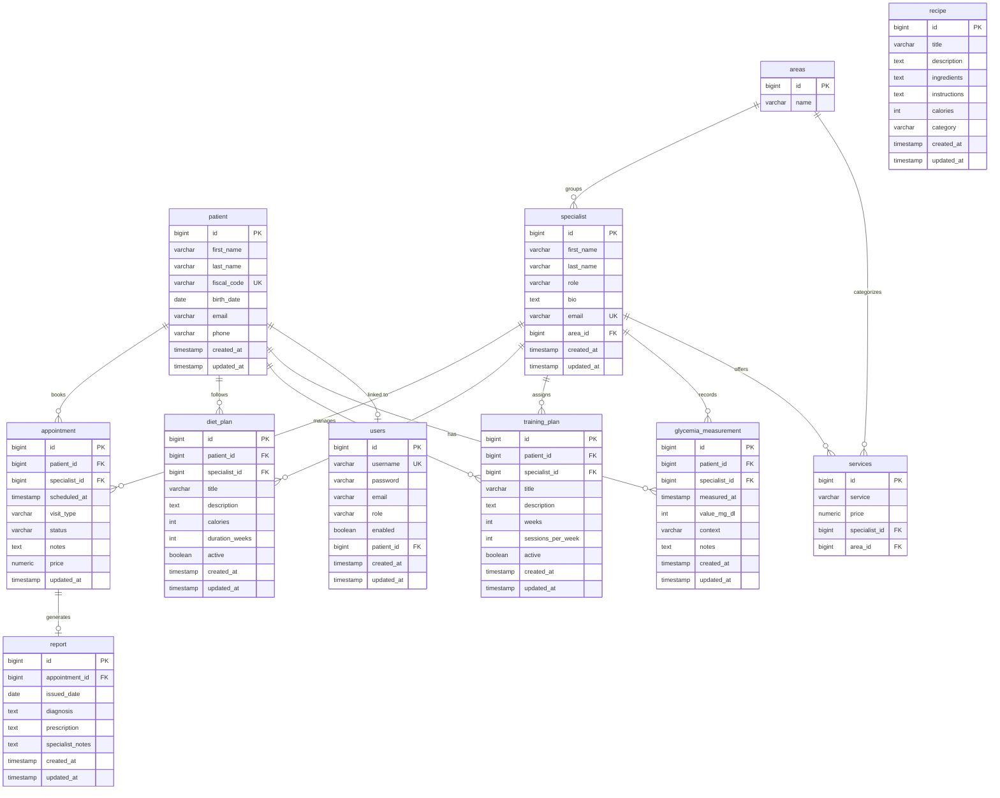

# ApiceClinic — Backend

REST API per la gestione di una clinica sportiva. Sviluppata con **Kotlin + Spring Boot 3** e autenticazione JWT.

---

## Tecnologie

| Layer | Tecnologia |
|---|---|
| Language | Kotlin 1.9 |
| Framework | Spring Boot 3.2.3 |
| Database | PostgreSQL 14+ |
| Migrations | Flyway |
| Security | Spring Security + JWT (jjwt 0.12) |
| Docs | SpringDoc OpenAPI (Swagger UI) |
| Build | Maven 3.8+ |

---

## Prerequisiti

- **JDK 21**
- **Maven 3.8+**
- **PostgreSQL 14+** in esecuzione su `localhost:5432`

Crea il database prima di avviare:
```sql
CREATE DATABASE apiceclinic;
```

---

## Configurazione

Il profilo attivo di default è **`dev`**. Le variabili di ambiente hanno la precedenza sui valori di default.

| Variabile | Default |
|---|---|
| `DATABASE_URL` | `jdbc:postgresql://localhost:5432/apiceclinic` |
| `DATABASE_USERNAME` | `postgres` |
| `DATABASE_PASSWORD` | `password` |
| `JWT_SECRET` | `ApiceClinicSecretKeyForJWTTokenGenerationMinimum256BitsRequired1234567` |
| `JWT_EXPIRATION` | `86400000` (24h, in ms) |

---

## Avvio

```bash
mvn spring-boot:run -pl apiceclinic-module/clinic
```

Al primo avvio Flyway applica tutte le migrazioni e **DataInitializer** crea gli utenti di default.

---

## Credenziali di accesso

### Admin
```
username: admin
password: admin123
role:     ROLE_ADMIN
```

### Utente standard
```
username: user
password: user123
role:     ROLE_USER
```

---

## Documentazione API

Swagger UI disponibile a runtime:
```
http://localhost:8080/swagger-ui.html
```

OpenAPI JSON:
```
http://localhost:8080/v3/api-docs
```

---

## Schema ER



